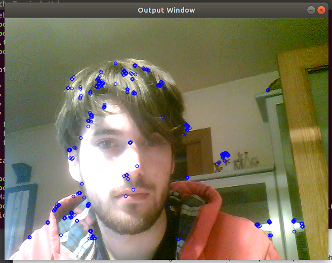
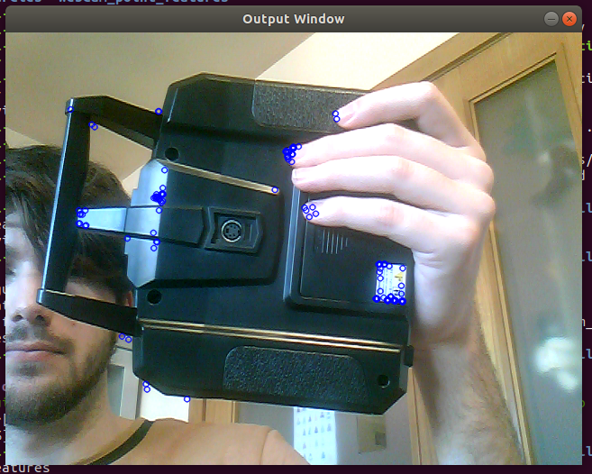

# webcam_point_features
Exercise 2.1 of the Perception Systems course. Detection of ORB features from online webcam images.

We start the exercise by forking the git repository https://github.com/beta-robots/webcam_point_features, cloning it to our computer with the command

    $  git clone https://github.com/EloiSoldevilaDalmau/webcam_point_features
  
and building the point_capture example.

To build it we create a directory called "build" inside the webcam_point_features directory

    $ mkdir build
and, being inside the new directory we compile and run the make file. First with 

    $ cmake .. 
and then 

    $ make 

To execute the example we write 

    $ ./point_features 
when inside the build directory.

The following image is an example of what can be seen using it.

    
# Explanation of ORB features

ORB is a function that detects the keypoints of an image. A keypoint is a point of an image that correspond to an spatial location and stand out because no matter how the image changes the same keypoint can be found. Keypoints are used to find which spatial points can be found in more than one image. The way you find keypoints is with functions like ORB.

ORB first uses the FAST keypoint detector to detect interesting keypoints. To find keypoints FAST looks at the pixels surrounding a point and compares the contrast between a point and its surroundings. An interesting keypoint will be one point that has lots of contrasts with the points surrounding it in different directions.

ORB also gives a description (of its information, position, orientation...) of each of these interesting keypoints with an function based on BRIEF descriptors.

References:

https://docs.opencv.org/3.0-beta/doc/py_tutorials/py_feature2d/py_orb/py_orb.html

https://docs.opencv.org/3.0-beta/doc/py_tutorials/py_feature2d/py_fast/py_fast.html

https://opencv-python-tutroals.readthedocs.io/en/latest/py_tutorials/py_feature2d/py_brief/py_brief.html

http://www.willowgarage.com/sites/default/files/orb_final.pdf

# Aplication of a mask

After doing what we've done now we want to try to detect features more sparse over all the image by using a mask. To do these we will have to change the "point_features.cpp" file found in the "src" directory.

The idea is that we divide the whole image in 12 smaller rectangles (4x3) so the ORB function can focus in an smaller region of an image at any time and ensuring that we will find keypoints in all the regions of the image and not only on one place.

To do this, a part from initializing all the variables needed in the place of the code where the ORB function was we introduce some for functions dividing the image in the rectangles mentioned above and applying the ORB function in each of these regions (having also decreased the minimum number of point features for ORB function).

This increases a lot the lag of the output video but achieves the intended result.

We see a lot less keypoints than in the previous image because we have decreased a lot the number of keypoints we want to see but it can be seen that the keypoints are very sparse.

The files in this repository are the ones modified to apply the mask.
